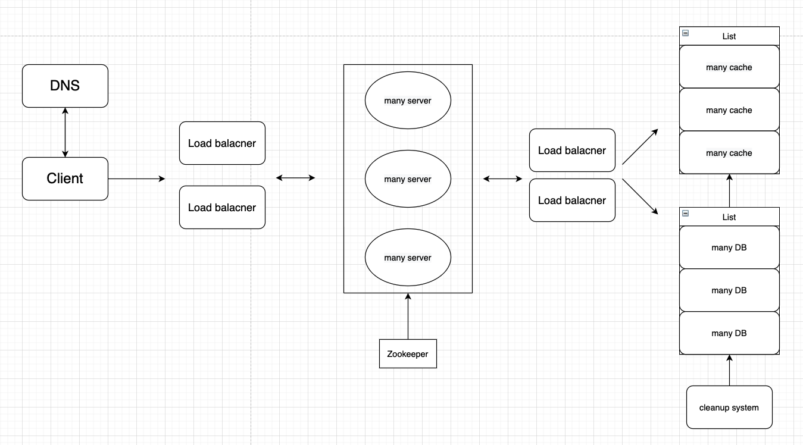
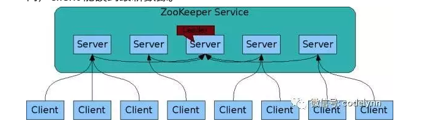

# 主要功能
第一個是將長網址轉成短網址，並回傳給 client。第二個是將 client 短網址轉址到真正的長網址。
## 流程
client 發 request 到 Load balancer。Load balancer 會有兩個，避免 Single point of failure。Load balancer 再把 request 分派到 server 上。

* 如果用戶是要將長網址轉成短網址，就會向 Zookeeper 請求新的短網址。Zookeeper 產生新網址後回傳給 server。server 將網址回傳給 client ，並將短網址和對應的長網址存入資料庫。  
* 如果用戶是輸入短網址，server 會向後面的快取和資料庫請求對應的長網址（一樣經過 LB）。並將 client 導至長網址。

## 如何產生短網址？
我們在產生新的短網址時，希望達到幾個目標。

* 產生的短址是不能預測的
* 產生的短址不要重複
* 六位數就夠了

方法是用 （原始的長網址 `url` + `counter`）去做 hash ，取 6 位。counter 會交由 zookeeper 管理，counter 會一直增加，這樣確保 hash 出來的東西不會一樣。

## 如何儲存？
要存取大量的短網址，一個 DB 會不夠。會用 hash 出來的第一個字元做分類，分配到各個 DB。

## 快取
會先向 cache 找，沒有才去 DB 找。DB 找到後會先回傳，之後再由 LB 去更新 cache。
## 備份
使用 consistent hash 做備份。將當前節點的資料備份到順時鐘的下一個節點。這樣不管增加或減少節點都能因應。
## 相關解釋：
* Load balancer：負責將大量的作業分散到各個主機上，將每個伺服器負載平衡，以達到最佳化的使用效率。
* Zookeeper：分佈式應用程式協調服務。這邊主要是統一不同 server 間的 counter。
* 

# 找完資料的一點感想
查到比較普遍的設計，是在 zookeeper 被替換成專門的 key generating service，再連 DB 和備份 DB。在database 裡面過期的短址，可以被回收放進 key-DB。優點是生生不息，可以一直回收。缺點是跟 zookeeper 比起來，要多 key-DB和備用 server。
也讓我覺得疑惑，這套系統架構，如何將短址回收再利用？如果不行是會有問題的嗎（畢竟 568 億個組合好像也很夠用）？  
感覺我好像挖太深了，花太多時間了。
