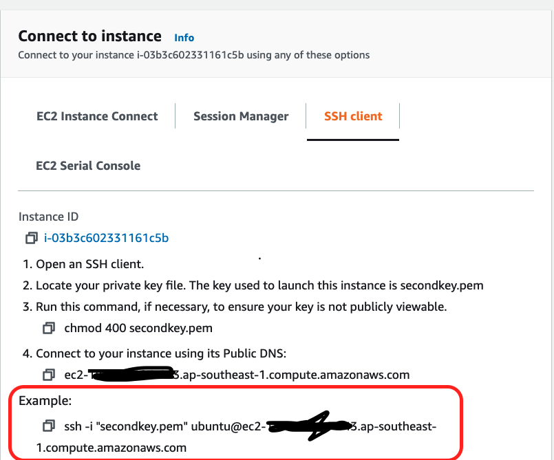
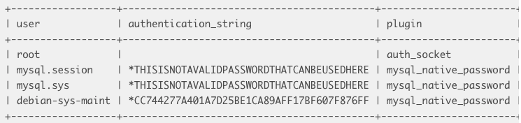
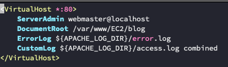

過程有些挫折。聽了助教在 podcast 分享之前參加課程覺得最難的是哪一週，也有部署這一週。但其實現在回頭看看老師下面貼的心得文，真的好棒，只要照做就可以輕鬆部署。當初看的時候完全看不懂，也不知道為什麼要這樣做。剛好作業上的敘述是建議我們先自己找資料，所以就踏上了自己找資料的旅途。
#過程
## AWS：
先租主機才能開始。開一個 AWS 帳號上面有各式各樣的服務。選擇 EC2 開始創建 instance。

* step1：要選擇主機的作業系統。我是用 ubuntu Server 20.04。只要下面有標籤寫`Free tier eligible` ，就是免費的，可以選你想用的。
* step2：選免費的就對了。
* step3：基本上沒有特別需求就跳過。
* step4：選擇主機的容量。免費帳戶好像最多可以用 30 GB。但也不建議就調 30 GB。畢竟超過就要收錢了。預設就足夠了。
* step5：可以幫主機加標籤。
* step6：可以設定連線到主機的 port。我覺得可以等之後有需求再調整。  
然後記得下載金鑰，放在桌面會比較方便。
接著要下載 LAMP。L(linux) 已經好了，接著就是 Apache、MySQL、PHP。

## Apache：
要下載 Apache，要先跟虛擬主機連線。在 AWS 上選擇你的主機，按下上面的 connect。 接著會跑出下面的圖。最重要的是紅色框框中的東西。  
打開你的終端機，輸入 aws 給你的 example。圖中的 	”secondkey.pem“ 記得放你自己金鑰的路徑。
```
sudo apt update
sudo apt install apache2
```
載好後就再跑下面這個
```
sudo ufw allow in "Apache Full"
```打開 port 80/443
之後用瀏覽器去連接主機的 IP 位置應該就能看到 Apache 的預設頁面。

## MySQL
```
sudo apt install mysql-server
```
'Y' 就對了。  
```
sudo mysql_secure_installation
```
接著會問你要不要啟用 `VALIDATE PASSWORD PLUGIN.` 如果啟用的話，MySQL 密碼的強度就會被檢驗，強度不夠不能被設置。
我怕麻煩就沒開啟這項功能，但密碼還是要好好設定。之後的問題都按 'yes'。
為了用 phpMyAdmin，我們要修改一下 MySQL 的設定。
```
sudo mysql
SELECT user,authentication_string,plugin,host FROM mysql.user;
```  
進去之後可以看到這張表。
可以看到 root 對應的 `plugin` 是 `auth_socket `。我們要把它改成 `mysql_native_password`。不然 phpMyAdmin 沒辦法用密碼登入進去。  
`ALTER USER 'root'@'localhost' IDENTIFIED WITH mysql_native_password BY 'password';
` 記得上面的 password 要改成自己設定的密碼。我之前就忘了改，想說我怎麼都進不去。  
```
FLUSH PRIVILEGES;
SELECT user,authentication_string,plugin,host FROM mysql.user;
```更新完後再看一次剛剛的 table ，`root`  的`plugin` 應該要是 `mysql_native_password`。

## PHP
裝起來
```
sudo apt install php libapache2-mod-php php-mysql
```  
接著我會在 /etc/apache2/sites-avaliable 新增一個設定檔。當然如果你想直接改裡面的 default 也可以。
把 DocumentRoot 改成網站的路徑。其他跟圖一樣。
```
sudo a2ensite your.conf
sudo a2dissite 000-default.conf
```
上面是啟用你的設定，下面是取消預設的設定檔。
```
sudo systemctl restart apache2
```
之後重開 apache 就可以生效。這時候訪問網站應該要可以看到你在那個路徑的 php 檔案了。預設是載入 index.php。
## phpMyAdmin
裝起來
```
sudo apt update
sudo apt install phpmyadmin php-mbstring php-gettext
```
記得 server 要選 apache2 。然後之後會叫你設定密碼。
```
http://your_domain_or_IP/phpmyadmin
```
就可以連到 phpmyadmin。我是用 root 登入，密碼就是在 MySQL 設定的那個。
## 怎麼把檔案傳去遠端主機？
用 git clone 最方便惹～
# 遇到的問題：
* 不知道為什麼 scp, sftp 我檔案都傳不過。好像是權限不足，但我也不知道要怎麼增加我的權限。用了很多方法都無效。最後用 git clone 解決。
* 不知設了什麼防火牆的設定，結果之後就沒辦法用 ssh 的方式連上主機。不知道怎麼解決，所以直接重開主機xD。
* 設錯 MySQL root 的密碼，導致我連 MySQL 都進不去。有試著用 google 的解決方式，之後也重灌，但都無效。後來因為防火牆問題重開主機解決。
* 結論，有問題先換主機就對了（Ｘ）


