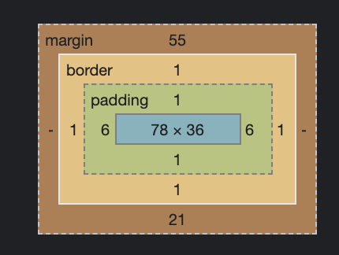

## 請找出三個課程裡面沒提到的 HTML 標籤並一一說明作用。
script : 引入 JS 的標籤  
hr : 分隔線  
code: 可以直接放程式碼

<pre>
<code>  //放入程式碼
let i =0
let x =3
</code>
</pre>
## 請問什麼是盒模型（box model）

box model 主要就是由外面的 margin、 border、裡面的 padding、content 這四項組合而成。

* margin: 是 border 外面的邊距。背景永遠為透明。根據排版需求，數值可以是負數。
* border: 邊框。
* padding: border 的內邊距。在 content 外面但被 border 包住。背景可以被改變。數值不可為負數。 
* content: 內容呈現的地方。  

## 請問 display: inline, block 跟 inline-block 的差別是什麼？
* inline: 行內元素。圖片或文字都不會換行。不能設定長寬，依據裡面的內容來決定長寬。
* block: 區塊元素。元素寬度會撐滿整個 row。可以設定長寬，但還是會佔滿整個 row。
* inline-block: 行內區塊。元素以 inline 方式呈現，但仍保有 block 可以設定長寬的屬性。元素也可以併排在同個 row。  

常見的區塊元素標籤：div 、 ul 、 li 、h1  
常見的行內元素標籤：a 、 span 、input 、img

## 請問 position: static, relative, absolute 跟 fixed 的差別是什麼？
* static: position 預設屬性。  
* relative: 根據元素本來顯示的位置為基準，來進行上下左右的移動。且本來顯示的空間會保留不會消失。  
* absolute: 根據 position 為非 static 的父元素為基準，來進行上下左右的移動。但本來顯示的空間會消失。跳脫排版。  
* fixed: 以整個視窗（body）為基準，上下滑動頁面，該區塊還是會停留在同個地方。跳脫排版。
